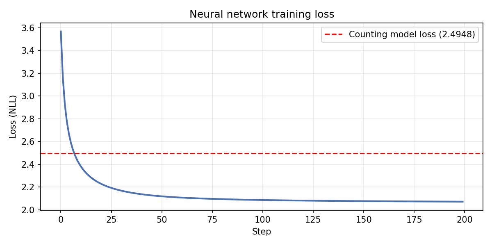

# bigram-namegen

A small, from-scratch character-level **bigram language model** for generating new names — built two ways, side by side, so you can see exactly how a "counting" statistical model relates to a single-layer neural network trained by gradient descent.

This started as an exploratory Jupyter notebook (included in [`notebooks/`](notebooks/exploration.ipynb)) and has been refactored into a small, tested, command-line-friendly Python package.



## How it works

Both models answer the same question: *given the current character, what character comes next?* They differ only in how they arrive at that probability distribution.

1. **Counting model** — count how often each character follows each other character across the whole training set (with a `.` token marking the start/end of a name), then normalize each row into a probability distribution (Laplace-smoothed so nothing is ever exactly zero).
2. **Neural model** — a single `vocab_size × vocab_size` weight matrix `W`, trained with plain gradient descent to minimize the negative log-likelihood of the training data. One-hot encode the current character, multiply by `W`, exponentiate, normalize (softmax) — mathematically this is just multinomial logistic regression, but it converges to essentially the same probabilities as the counting model.

Both models can then generate brand-new names by repeatedly sampling from their respective probability distributions, starting and ending at the `.` token.

This project follows the same approach as Andrej Karpathy's [makemore](https://github.com/karpathy/makemore) bigram example, restructured here as a small package with tests and a CLI rather than a single notebook.

## Installation

```bash
git clone https://github.com/<your-username>/bigram-namegen.git
cd bigram-namegen
pip install -e .
```

Requires Python 3.9+ and [PyTorch](https://pytorch.org/). Plotting the loss curve additionally requires `matplotlib` (included in `requirements.txt`).

## Usage

### Command line

Train and sample from both models on the bundled example dataset (50 fantasy villain names):

```bash
python -m bigram_namegen --data data/villain_names.txt --model both --num-names 20
```

Train only the neural model for longer, with a different learning rate, and save a loss-curve plot:

```bash
python -m bigram_namegen --data data/villain_names.txt --model neural \
    --steps 500 --lr 20 --plot
```

Use your **own** list of names — any plain-text file with one name per line:

```bash
python -m bigram_namegen --data path/to/your_names.txt
```

All options:

| Flag           | Default                       | Description                                  |
|----------------|--------------------------------|-----------------------------------------------|
| `--data`       | `data/villain_names.txt`      | Path to a newline-delimited names file        |
| `--model`      | `both`                        | `counting`, `neural`, or `both`                |
| `--num-names`  | `20`                           | Names to sample per model                      |
| `--steps`      | `200`                          | Neural model training steps                    |
| `--lr`         | `50.0`                         | Neural model learning rate                      |
| `--seed`       | `2147483647`                   | Random seed for reproducibility                 |
| `--plot`       | off                            | Save a PNG of the neural model's loss curve     |
| `--plot-output`| `nn_loss.png`                  | Where to save that PNG                          |

### As a library

```python
from bigram_namegen import (
    load_words, build_vocab,
    build_bigram_counts, counts_to_probabilities, generate_names_counting,
    train_neural_model, generate_names_neural,
)

words = load_words("data/villain_names.txt")
vocab = build_vocab(words)

# counting model
N = build_bigram_counts(words, vocab)
P = counts_to_probabilities(N)
print(generate_names_counting(P, vocab, num_names=5))

# neural model
W, loss_history = train_neural_model(words, vocab, steps=200, lr=50.0)
print(generate_names_neural(W, vocab, num_names=5))
```

## Example output

```
Loaded 50 names from data/villain_names.txt
  shortest='nemexia' longest='gravemourne' avg_len=8.4
Vocabulary size: 26 ('.abcdefghiklmnopqrstuvwxyz')

=== Counting model ===
Average NLL over 472 bigrams: 2.4948
Generated names:
  ucr
  fnpzorinemoruukmzbysk
  puvdra
  ...

=== Neural model ===
step    0 | loss: 3.5669
step  199 | loss: 2.0711

(For comparison, counting-model loss: 2.4948)
Generated names:
  kolr
  pllthanewisorima
  mornorax
  ...
```

With only 50 training examples, neither model has enough data to reliably generate names that *sound* fully plausible — but the neural model's loss reliably converges below the counting model's baseline, which is the interesting part: gradient descent rediscovers (and slightly out-performs, due to its smoother probability estimates) the same statistics you'd get by just counting.

## Project structure

```
bigram-namegen/
├── data/
│   └── villain_names.txt      # example training data (50 fantasy villain names)
├── notebooks/
│   └── exploration.ipynb      # original exploratory notebook
├── src/bigram_namegen/
│   ├── data.py                # loading & cleaning names
│   ├── vocab.py                # character vocabulary / stoi / itos
│   ├── counting_model.py       # bigram counting + probabilities + sampling
│   ├── neural_model.py         # single-layer network + training loop + sampling
│   ├── plotting.py             # loss-curve plotting
│   └── cli.py                  # `python -m bigram_namegen` entry point
├── tests/                       # pytest unit tests
└── assets/                      # images used in this README
```

## Running tests

```bash
pip install -r requirements-dev.txt
pytest
```

## Using your own data

Replace `data/villain_names.txt` with any plain-text file containing one name per line — character names, real first names, product names, whatever you'd like the model to imitate — and point `--data` at it. The model makes no assumptions about the alphabet beyond "whatever characters appear in the file."

## Limitations

This is a bigram model: it only ever looks one character back, so it can't capture longer-range patterns (it has no notion of syllables, common prefixes/suffixes beyond two characters, etc.). It's intentionally minimal, intended as a clear illustration of the connection between counting-based and gradient-based language modeling rather than as a production name generator. For longer context, see Karpathy's [makemore](https://github.com/karpathy/makemore) for the natural next steps (MLP, then a small Transformer).

## License

[MIT](LICENSE)
